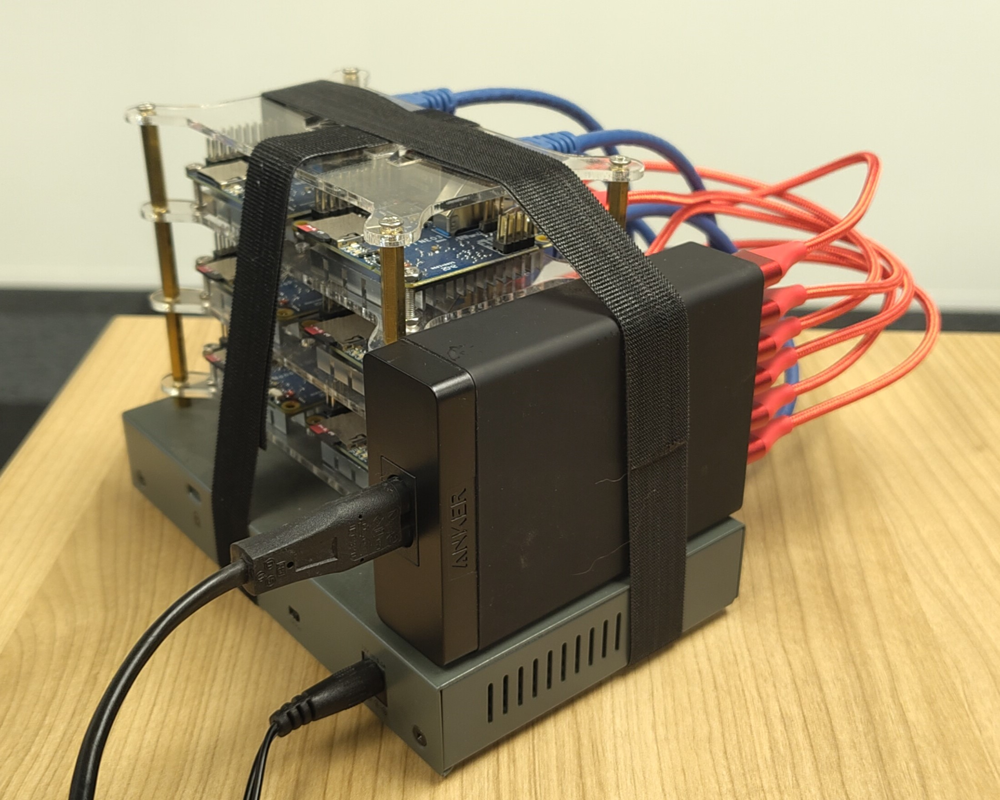
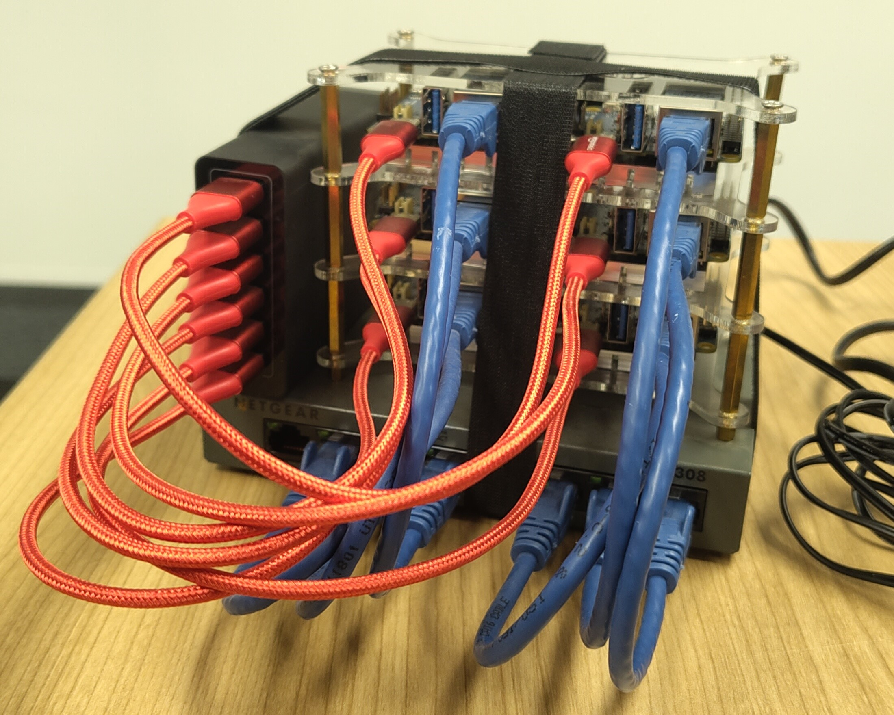
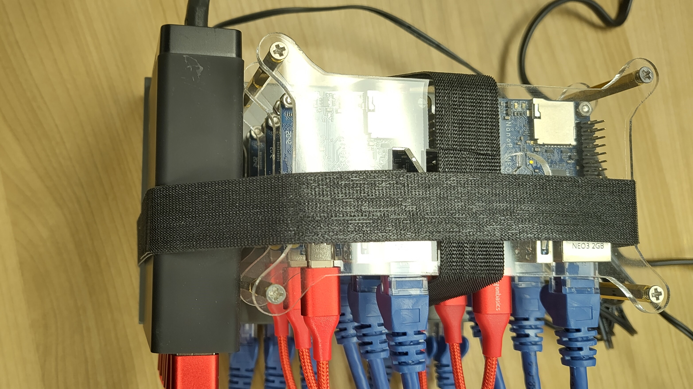

# nanocluster
The NanoPI Neo3 cluster documentation project


## NanoPI Neo3 Cluster

This project is a documentation project for the NanoPI Neo3 cluster. The NanoPI Neo3 is a small single board computer with a quad core ARM processor and 1GB of RAM. The NanoPI Neo3 is a low cost single board computer that is ideal for building a small cluster. The [NanoPI Neo3 is available from FriendlyElec](https://wiki.friendlyelec.com/wiki/index.php/NanoPi_NEO3#Introduction).

## Cluster Hardware

The NanoPI Neo3 cluster is built using the following hardware:

 - 6 x [NanoPI Neo3](https://wiki.friendlyelec.com/wiki/index.php/NanoPi_NEO3) single board computers
 - Netgear GS308 8 port gigabit switch
 - Anker 60W 6 port USB charger





## Cluster Software
### Install and configure nodes

The nodes uses a [dietpi image](https://dietpi.com/#download) for the `NanoPi NEO3`.
Please, *extract* the image from the archive (.img.gz) with a file manager before *restoring* it with [Gnome Disks](https://apps.gnome.org/en-GB/DiskUtility/) to the SD cards. After that, mount the DIETPISETUP partition manually to make sure to have write access to the volume.

```sh
sudo mount /dev/sda2 /mnt
ls -lha /mnt
```

The resolt should be:

```
total 46K
drwxr-xr-x  2 root root  16K Jan  1  1970 .
drwxr-xr-x 18 root root 4.0K Feb 12 14:21 ..
-rwxr-xr-x  1 root root  336 Feb 20 01:27 dietpiEnv.txt
-rwxr-xr-x  1 root root  18K Feb 20 01:27 dietpi.txt
-rwxr-xr-x  1 root root 3.9K Feb 20 01:27 dietpi-wifi.txt
-rwxr-xr-x  1 root root  440 Feb 20 01:27 Readme-DietPi-Config.txt
```

Then use the [script](sed.sh) to replace the default values. In this case the Micro SD card is used for the firts node:

```sh
sudo ./dietpi 1
``` 

The [script](sed.sh) changed the hostname of the nodes to `neo` with a host nuber from the first argument of the [script](sed.sh). So `./dietpi 1` changes it to `neo1`. It also sets a static ip address for the `192.168.1.0/24` network. In this case it became `192.168.1.101`. More information is in the network configuration folder: `/mnt/etc/network`.

> [!TIP]
> Generate a ssh key pair bevore using the [script](sed.sh). It will copy the id_ed25519 public key from the users home dirictory.
> 
> ```sh
> ssh-keygen -t ed25519 -C "ansible@host.local"
> ```

Umount `/mnt` and repeat for the other nodes:

```sh
sudo umount /mnt
```

> [!TIP]
> Validate with `ssh dietpi@192.168.107.101`.

### Install Kubernetes

Install `ansible-core` on the workstation and create or edit `/etc/ansible/hosts` to:

```
[nodes]
192.168.107.101
192.168.107.102
192.168.107.103
192.168.107.104
192.168.107.105
192.168.107.106
```

create a ansible playbook for installing Kubernetes on the nodes:

```yaml
---
- name: Install MicroK8s on DietPi/Debian nodes
  hosts: nodes
  become: yes
  tasks:
    - name: Update apt cache
      apt:
        update_cache: yes
      changed_when: false

    - name: Install snapd with apt
      apt:
        name: snapd
        state: present

    - name: Ensure snapd service is running
      service:
        name: snapd
        state: started
        enabled: yes

    - name: Install MicroK8s
      command: snap install microk8s --classic
      args:
        creates: /snap/bin/microk8s

    - name: Add the current user to the microk8s group
      user:
        name: "{{ ansible_user }}"
        groups: microk8s
        append: yes

    - name: Wait for MicroK8s to be ready
      command: microk8s status --wait-ready
      become_user: "{{ ansible_user }}"

    - name: Disable root login by changing shell
      user:
        name: root
        shell: /usr/sbin/nologin
```

And run it with:

```sh
ansible-playbook -i /etc/ansible/hosts nodes.yml
```

<!-- Verify the nodes on neo1:

```sh
kubectl get nodes
``` -->
