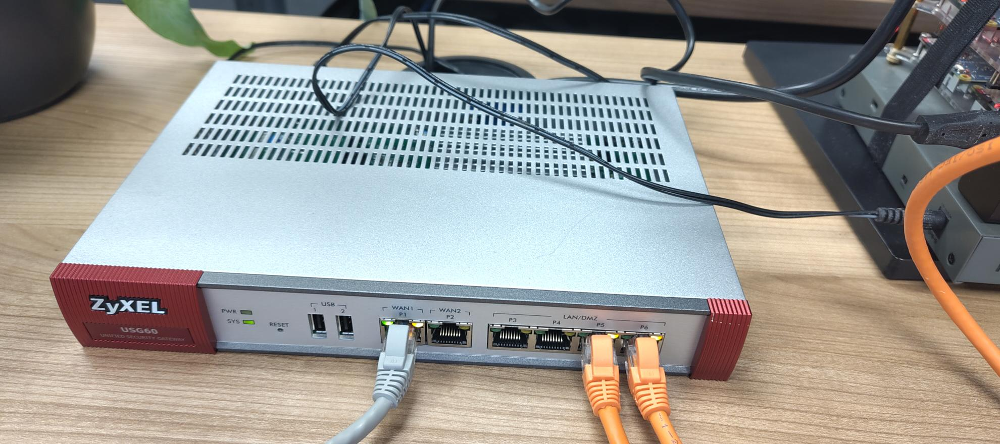

# nanocluster
The NanoPI Neo3 cluster documentation project


## NanoPI Neo3 Cluster

This project is a documentation project for the NanoPI Neo3 cluster. The NanoPI Neo3 is a small single board computer with a quad core ARM processor and 1GB of RAM. The NanoPI Neo3 is a low cost single board computer that is ideal for building a small cluster. The [NanoPI Neo3 is available from FriendlyElec](https://wiki.friendlyelec.com/wiki/index.php/NanoPi_NEO3#Introduction).

## Cluster Hardware

The NanoPI Neo3 cluster is built using the following hardware:

 - 6 x [NanoPI Neo3](https://wiki.friendlyelec.com/wiki/index.php/NanoPi_NEO3) single board computers
 - Netgear GS308 8 port gigabit switch
 - Anker 60W 6 port USB charger


### Router

A random router with username `admin` and password `admin` (if you reset it then it is `1234`). I don't have a licence so the network is `192.168.1.0/24` with the first host as default gateway. Also, disable the wifi network, ssh, ftp and enable ipv6 in expert mode. More in the [documentaion](https://download.zyxel.com/USG60/user_guide/USG60_V4.73_Ed1.pdf).



> Note: You can see the ip addresses and hostnames in the port forwarding wizzard in Easy Mode.

## Cluster Software
### Operating System

The nodes uses the [official debian bookworm image](https://drive.google.com/drive/folders/1_sdgoOb8s5yJn3KVmAKn7AkIrN9bM7-g) from [Google Drive](https://drive.google.com/drive/folders/1_sdgoOb8s5yJn3KVmAKn7AkIrN9bM7-g) as mentioned in the [wiki](https://wiki.friendlyelec.com/wiki/index.php/NanoPi_NEO3#Downloads).
Please, *extract* the image from the archive (.img.gz) with a file manager before *restoring* it with [Gnome Disks](https://apps.gnome.org/en-GB/DiskUtility/) to the SD cards.

### Cluster Network configuration

The hostname of the nodes is `neo` with the host nuber of the ip address in `192.168.1.0/24`. For example `neo1` with `192.168.1.1`. The network configuration files are in the `/etc/network` folder. Please, change the `interfaces` to:

```
source interfaces.d/*

auto lo
iface lo inet loopback

auto lo
iface lo inet6 loopback
```

And create `eth0` in `/etc/network/interfaces.d/`:

```
allow-hotplug eth0

iface eth0 inet dhcp
iface eth0 inet6 auto
```

> It is also posseble to use the [config script](./config.sh) like this: `sh ~/nanocluster/config.sh 1`.

## Workstacion (optional)

I use a Raspbery Pi 5 as a development workstacion. It runs on [Alpine Linux](https://wiki.alpinelinux.org/wiki/Raspberry_Pi) with the Gnome desktop. Gnome uses Network Manager. So, remove `/etc/network/interfaces` so that Network Manager may manage the network interfaces. Otherwise the desktop things that you have no internet connection.

By default Alpine Linux has no Raspbery Pi configuration file. So, I copyied the default `config.txt` from the official Raspbery Pi OS and renamed it to `usercfg.txt`. Compair it with the default `config.txt` from Alpine Linux and remove dubble stuff from `usercfg.txt`. So that is looks like this:

```
# For more options and information see
# http://rptl.io/configtxt
# Some settings may impact device functionality. See link above for details

# uncomment if you get no picture on HDMI for a default "safe" mode
hdmi_safe=1

# PI 5
BOOT_UART=1
POWER_OFF_ON_HALT=1
BOOT_ORDER=0xf416

# Uncomment some or all of these to enable the optional hardware interfaces
#dtparam=i2c_arm=on
#dtparam=i2s=on
#dtparam=spi=on

# Enable audio (loads snd_bcm2835)
dtparam=audio=on

# Additional overlays and parameters are documented
# /boot/firmware/overlays/README

# Automatically load overlays for detected cameras
#camera_auto_detect=1

# Automatically load overlays for detected DSI displays
display_auto_detect=1

# Enable DRM VC4 V3D driver
dtoverlay=vc4-kms-v3d
max_framebuffers=2

# Don't have the firmware create an initial video= setting in cmdline.txt.
# Use the kernel's default instead.
disable_fw_kms_setup=1

# Disable compensation for displays with overscan
disable_overscan=1

# Run as fast as firmware / board allows
arm_boost=1

[cm4]
# Enable host mode on the 2711 built-in XHCI USB controller.
# This line should be removed if the legacy DWC2 controller is required
# (e.g. for USB device mode) or if USB support is not required.
otg_mode=1

[all]
```

## DietPi Setup

Login with `ssh root@<IP address from dhcp server>` and the `dietpi` password.

`DietPi-Update` will be executed when logging in for the first time. After that install:

- docker
- k3s
- ansible
- avahi-daemon
- avahi-utils
- systemd-resolved
- a ssh client like dropbear or openssh

The first node will be our Kubernetes and Ansible controller. So install `ansible-core` and `iptables-persistent` on the first node.

### Hostname discovery with Avahi and resolved

Enable Avahi and resolved if not enabled to allow hostname discovery on all nodes:

```
sudo iptables -A INPUT -p udp --dport 5353 -j ACCEPT
sudo netfilter-persistent save
sudo sed -i '/^#MulticastDNS=yes/s/^#//' /etc/systemd/resolved.conf
sudo systemctl enable --now systemd-resolved
sudo ln -sf /run/systemd/resolve/stub-resolv.conf /etc/resolv.conf
```

### Kubernetes

Enable the `k3s` service if not enabled and edit or create `/etc/rancher/k3s/config.yaml`:

```
write-kubeconfig-mode: '0644'
tls-san:
  - neo1
  - neo2
  - neo3
  - neo4
  - neo5
  - neo6
```

Get the token on neo1:

```
sudo cat /var/lib/rancher/k3s/server/node-token
```

and use it to add the other nodes to the cluster:

```
curl -sfL https://get.k3s.io | K3S_URL=https://neo1:6443 K3S_TOKEN=<token> sh -
```

Verify the nodes on neo1:

```
kubectl get nodes
```

### SSH Keys

It is nice to have SSH keys to connect from the manager node to the worker nodes. So, create one on the manager node:

```
ssh-keygen -t ed25519 -C dietpi@neo1
cat .ssh/id_ed25519.pub >> .ssh/authorized_keys
```

And add it to the worker nodes:

```
echo "ssh-ed25519 XXXXXXXXXXXXXXXXXXXXXXXX dietpi@neo1.local" >> /home/dietpi/.ssh/authorized_keys
```

### Ansible

Edit or create `/etc/ansible/hosts`:

```
[control]
neo1

[managed]
neo2
neo3
neo4
neo5
neo6
```

### Disable root login

Edit the `/etc/passwd` file and change the shell from `/bin/bash` to `/usr/sbin/nologin` for the root user on every node.
